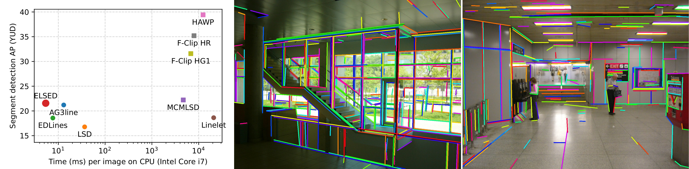

# ELSED: Enhanced Line SEgment Drawing


[](https://colab.research.google.com/github/iago-suarez/ELSED/blob/main/Python_ELSED.ipynb) [](https://arxiv.org/abs/2108.03144)  [](https://iago-suarez.com/ELSED)


This repository contains the source code of [**ELSED: Enhanced Line SEgment Drawing**](https://arxiv.org/abs/2108.03144) the fastest line segment detector in the literature. It is ideal for resource-limited devices like drones of smartphones. Visit the [**Project Webpage**](https://iago-suarez.com/ELSED) to try it online!



## Dependencies
The code depends on OpenCV (tested with version 4.1.1).
<details> 
<summary>To install OpenCV ... </summary> In Ubuntu 18.04 compile it from sources with the following instructions:

```shell script
# Install dependencies (Ubuntu 18.04)
sudo apt-get install -y build-essential cmake git libgtk2.0-dev pkg-config libavcodec-dev libavformat-dev libswscale-dev
# Download source code
git clone https://github.com/opencv/opencv.git --branch 4.1.1 --depth 1
# Create build directory
cd opencv && mkdir build && cd build
# Generate makefiles, compile and install
cmake -D CMAKE_BUILD_TYPE=RELEASE -D CMAKE_INSTALL_PREFIX=/usr/local ..
make -j
sudo make install
```
</details>

### Compile and Run

The code contains a demo detecting large and short line segments in one image.
The code can be compiled with Cmake:

```shell script
mkdir build && cd build
cmake .. && make
./elsed_main
```

The result for the provided image should be:
```
******************************************************
******************* ELSED main demo ******************
******************************************************
ELSED detected: 305 (large) segments
ELSED detected: 391 (short) segments
```

### Cite

```bibtex
@misc{suárez2021elsed,
      title={ELSED: Enhanced Line SEgment Drawing}, 
      author={Iago Suárez and José M. Buenaposada and Luis Baumela},
      year={2021},
      eprint={2108.03144},
      archivePrefix={arXiv},
      primaryClass={cs.CV}
}
```
